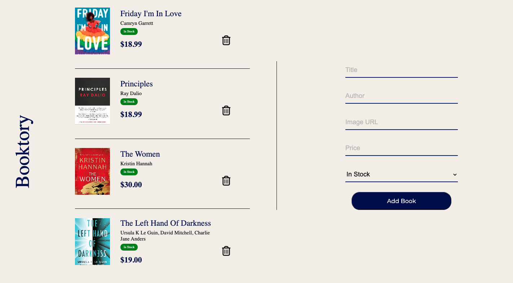
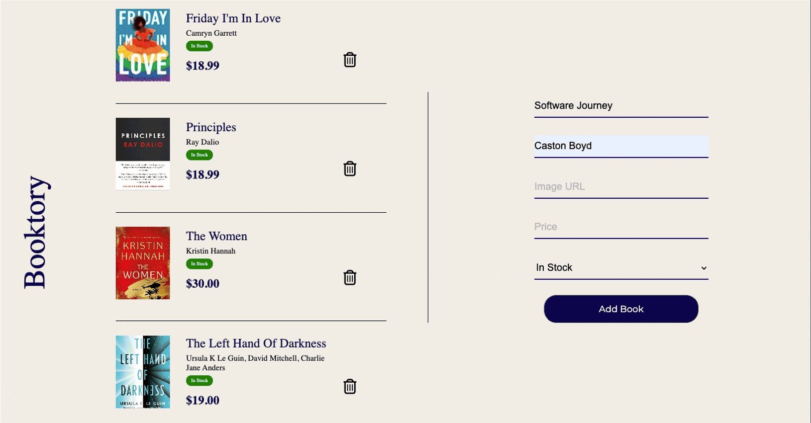
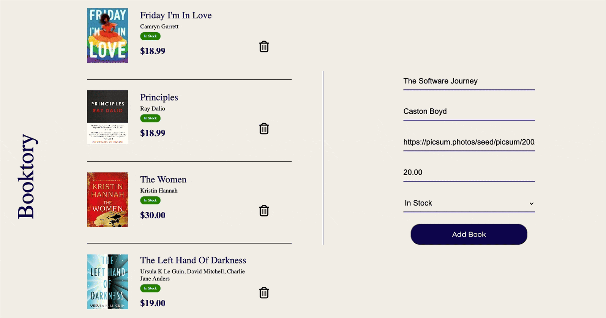
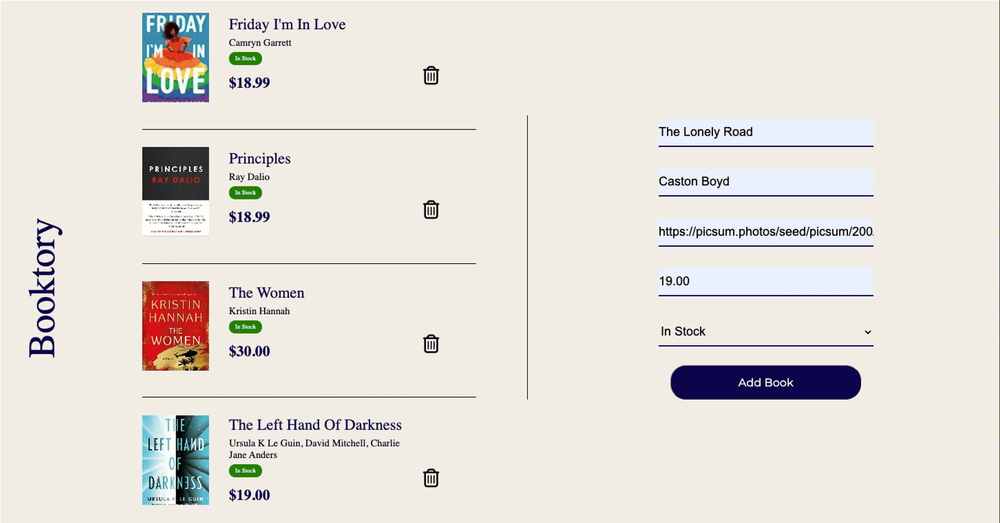

# Inventory Web Application Project

In this project, you will build a simple inventory management application for a single resource: books. Through your application, you will be able to visually display books, remove books from the inventory, and add new books to the inventory. This project will require heavy DOM manipulation in addition to a solid understanding of HTML and CSS.

## Purpose

The primary purpose of this project is to solidify your understanding of fundamental web development concepts by applying them in a real-world, project-based scenario. Here's why this is important:

1. **Understanding the Core**: At the heart of every interactive web application is the Document Object Model (DOM). Gaining a deep understanding of the DOM and how to manipulate it is important for any web developer. This knowledge forms the foundation upon which modern JavaScript frameworks and libraries are built.

2. **JavaScript Proficiency**: DOM manipulation with vanilla JavaScript requires you to practice and enhance your programming skills. It challenges you to think algorithmically, manage data, and manipulate the web page dynamically.

3. **Problem-Solving Skills**: Implementing features such as adding or removing books, and updating the display requires problem-solving and logical thinking. You'll learn how to break down user requirements into actionable steps and translate those into code.

4. **Event Handling**: Learning how to handle user inputs and actions is a key part of web development. By adding interactivity to your application, you'll understand event-driven programming, which is a pattern widely used beyond just web applications.

5. **Dynamic UI Updates**: Modern web applications often need to update the UI without requiring a page reload. This project teaches you how to create seamless user experiences by updating elements on the page in response to user actions.

6. **CSS Integration**: By styling the application, you'll learn how CSS selectors work and how they can be used to manipulate the look and feel of the web page elements dynamically.

7. **Application State Management**: Managing the state of the application (i.e., what books are currently in the inventory) is a key skill. This project introduces you to the concept of state and how changes to the state affect the UI.

8. **Preparation for Frameworks**: While you're using vanilla JavaScript in this project, the skills you acquire are directly transferable to more advanced libraries and frameworks. Understanding how to manipulate the DOM directly makes learning and working with libraries like React, Angular, or Vue.js much easier.

By completing this project, you'll have a practical, hands-on understanding of how dynamic websites work, from the user interactions down to the actual rendering of the webpage. This will serve as a solid foundation as you continue to learn and grow as a web developer.

## Level: Choose Your Journey 🚀

Grades don't always tell the whole story, do they? In the real world, what really counts is your ability to get things done, meet deadlines, and even exceed expectations. 🎯 Whether you're in it to acquire a new skill or to become a top-notch developer, the effort you put in often paves the way to success in software development. Below are the paths you can take. Decide who you want to be and establish the habits that will position you to get there. 

**Level 0:** The Dabbler Developer 😴 - Incomplete projects. Lacks a consistent coding routine and doesn't create a distraction-free zone for development.
 

**Level 1:** The Essentials Developer ✅ - Ticks all the boxes by completing the project requirements, but doesn't venture beyond the given tasks.
 

**Level 2:** The Aspirant Developer 🌱 - Not only finishes the project but also adds additional features or techonologies. They're curious and want to try making the project as close to an application someone with use (superb UI/UX)
 

**Level 3:** The Standout Developer (Cant be ignored) 🚀 -  Goes beyond the basics to deliver an application that's both fully functional and aesthetically unique. Crafts a custom layout, injects personal creativity, and utilizes advanced tools or frameworks that elevate the project to industry standards. The Trailblazer's work is not just complete – it's a testament to their innovative spirit and dedication to the craft.
 

## Completion

### Set up

1. Create a GitHub repository.
2. Your GitHub repository should have a `README.md` file with setup instructions and a guide on how to run your application.

### Styling

1. The page should have a cohesive and professional style, that makes use of a few specific colors.
2. The page should make use of CSS Grid, and include at least two columns.
3. The page should have at least one responsive element on the page that changes depending on the screen's size.

### On Load Features

1. Users can see a header on the side of the page that includes a title for the web application.
2. Users can see three unique resources, that include the following fields and at least two others:
   - name
   - price
   - in stock
3. Users can see a "Remove" icon associated with each resource.
4. Users can see a form that includes all fields for each resource, and a "Submit" button.

### Interactive Features

1. When a user clicks on the "Remove" button for each resource, that resource is removed from the page.
2. The form should require at least three of the fields of the resource to be required. If the "Submit" button is clicked and those requirements are not met, an error message should be shown to the user telling them exactly what is wrong. The form fields should stay filled in and a resource should not be created.
3. When the "Reset" button is clicked, the form should be cleared.
4. When the form is completed correctly, the form should be cleared and a new resource should appear at the top or bottom of all previous resources.

### Mastery rubric

This section of the project is designed to measure your increasing skill at writing good code and following best practices.

To view components of the mastery rubric, view the appropriate assignment on Canvas.

### Stretch goals

This section of the project measures your ability to go above and beyond in creating your project. To score points in this section, you should incorporate a feature, technology, or skill not explicitly required by the project instructions.

When you submit your p, _make sure to include a description of any stretch goals you implemented._ You may choose from the list below or come up with features or tasks that are more relevant to your specific implementation of the project.

- When a resource is clicked, the element is expanded and more information is displayed.
- If a field is missing a value, provide a default value when a resource is created on the page.
- Allow for the ability to edit existing resources, by using the already existing form.
- Incorporate complex CSS properties like [transition effects](https://css-tricks.com/almanac/properties/t/transition/).
- Create a Footer that sticks to the bottom of the browser window even if all elements have been removed.

## Project setup and overview

There are no tests for this project and you _should not_ fork and clone this repository. Instead, create a new repository.

## Example

The following application chooses to use "books" as the main resource for this project.

Upon loading the page, three books (i.e., resources) can be seen with the required fields. The form is also visible. The page is styled professionally and makes use of CSS Grid.

If the form is submitted, error messages appear.

When the form is submitted correctly, a new resource is created. In this case, a new book appears on the left side of the screen. The form is then cleared of all values. The "Remove" button will be able to remove this book.

In this example, clicking "In Stock" or "Out of Stock" will toggle the value for that book. Notice how the label is visually distinctive depending on the status of the book.

## Submission
Once you completed, convert to a github pages and submit the link to your project.